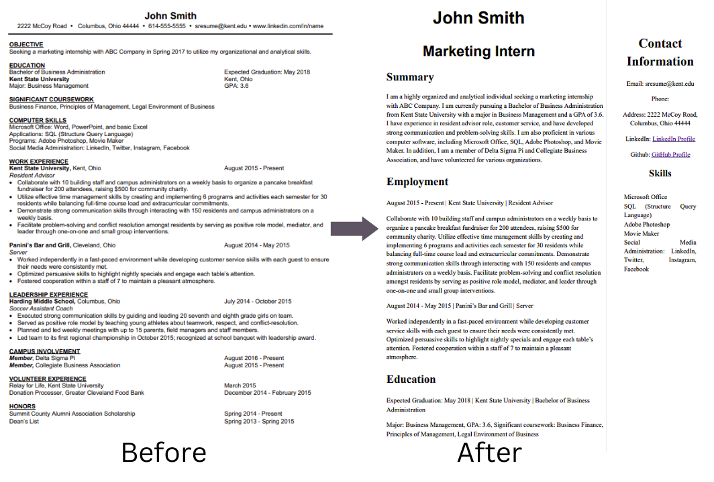

# SolidCV
This code utilizes the OpenAI ChatGPT model to improve resumes. It takes in a pdf resume, processes it, and then sends it to the chatbot to be improved. The improved resume is then exported as an html file.




## Getting Started
1. Clone the repository and navigate to the project directory.
2. Install the required packages using pip install -r requirements.txt.
3. Add a config.json file to the root directory with the following format: 
```{"session_token": "your_api_key"}```. <br /> 
Refer to the setup [guide](https://github.com/acheong08/ChatGPT/wiki/Setup) for more information.
4. Run the code using `python main.py --data_dir=path/to/data --input_resume=example_input.pdf --output_resume=new_resume.html --config_path=path/to/config.json`.
5. The improved resume will be exported as an html file in the data directory. To convert it to a pdf, open the html file and use the ctrl+p shortcut to print it to pdf.

## Using the command-line arguments
The script accepts the following command-line arguments:

- --`data_dir`: The directory containing the input and output files. Default value is `../data`
- --`input_resume`: The name of the input resume file. Default value is `example_input.pdf`
- --`output_resume`: The name of the output resume file. Default value is `new_resume.html`
- --`config_path` : The path to the configuration file. Default value is `config.json`

## Notes
- Ensure that the session token in `config.json` is valid and belongs to a ChatGPT model.
- Any error encountered during the execution of the script will be handled and the error message will be displayed on the console.

## Future Works
- Add more functionality to the improved resume
- Add more flexibility to the input and output formats
- Add more options to the command-line arguments
- Add more functionality to the script to handle exceptions
- Add a proper logging system
- Add a proper testing system
- Add more functionality to the script to handle cases where the input file is not a pdf file
